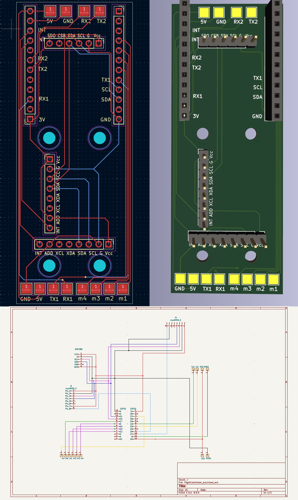

# ESP32 Flight Controller (ongoing)
Built using IDF 5.1.1, using custom implementation of DSHOT600, MPU6050 and CRFS parsing.

## Key Points
* 2x MPU6050 
* BMP280
* CRSF
* DSHOT600 (rmt)

## Hardware
* ESP32 ttgo
* MPU6050
* BMP280
* Radiomaster RP3 ExpressLRS ELRS 2.4GHz
* Sequre E70

## Performance
* IMU 200Hz (100Hz per imu)
* CRSF 500Hz
* control loop 2,5kHz 

## Components
* components/arduino/libraries/TFT_eSPI
* components/bmp280

## TODO
* Replace circular buffers with signal to improve performance
* Implement additional telemetry, drone -> controller
* Implement GPS module
* BIDI dshot600
* rpm filtering

## Known issues
* ESP32 gpio pin 37 needs to be remapped, need to be analog

### Schematics

## noteable issues solved
* stuttering motors - solved by sleep/wait after rmt write
* dmp above 100hz (write to fw) freaks out after a while

